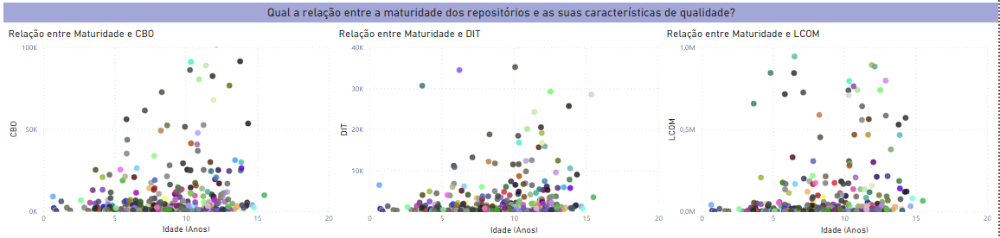

# Relatório: Análise dos Atributos de Qualidade em Repositórios Open-Source Java

## 1. Introdução

No contexto do desenvolvimento de software open-source, onde múltiplos colaboradores trabalham em diferentes partes do código, há um risco significativo de que atributos de qualidade interna, como modularidade, manutenibilidade e legibilidade, possam se deteriorar.

Para mitigar esses riscos, muitas abordagens modernas integram boas práticas como integração contínua e análise de código. Este relatório tem como objetivo analisar os atributos de qualidade interna de repositórios Java populares, correlacionando-os com características de desenvolvimento usando métricas CK.

## 2. Metodologia

### 2.1 Seleção de Repositórios

Selecionamos os 1.000 repositórios mais populares no GitHub escritos em Java. Para esses repositórios, coletamos as métricas discutidas abaixo usando as APIs do GitHub e uma ferramenta de análise estática, CK. Desses 1000, por problemas de execução, só foi possível analisar 420 repositórios.

### 2.2 Perguntas de Pesquisa

Este relatório busca responder às seguintes perguntas de pesquisa:
- **RQ1**: Qual é a relação entre a popularidade do repositório e seus atributos de qualidade?
- **RQ2**: Qual é a relação entre a maturidade do repositório e seus atributos de qualidade?
- **RQ3**: Qual é a relação entre a atividade do repositório e seus atributos de qualidade?
- **RQ4**: Qual é a relação entre o tamanho do repositório e seus atributos de qualidade?

**Hipóteses Informais**
- H1: Repositórios com maior popularidade apresentam melhor qualidade de código.
- H2: Repositórios mais maduros têm características de qualidade superiores.
- H3: Repositórios com maior atividade (número de releases) demonstram melhor qualidade.
- H4: O tamanho do repositório (em LOC) impacta negativamente a qualidade.

### 2.3 Métricas

#### Métricas de Processo:
- **Popularidade**: Número de estrelas no GitHub.
- **Maturidade**: Idade do repositório (em anos).
- **Atividade**: Número de releases.
- **Tamanho**: Linhas de código (LOC) e linhas de comentários.

#### Métricas de Qualidade:
- **CBO (Coupling Between Objects)**: Mede o grau de acoplamento entre as classes no projeto.
- **DIT (Depth of Inheritance Tree)**: Mede a profundidade máxima da hierarquia de herança no projeto.
- **LCOM (Lack of Cohesion of Methods)**: Mede o quão bem os métodos dentro de uma classe estão relacionados entre si.

Foram utilizados gráficos de dispersão para conseguir melhor analisar como essas métricas interagem entre si.

## 3. Resultados

### 3.1 Relação Entre Popularidade e Qualidade

- **CBO vs Popularidade (Contagem de Estrelas)**: Como visto no gráfico de dispersão, a maioria dos repositórios mais populares (com mais de 50 mil estrelas) apresentam valores baixos de CBO quando comparados com a média encontrada para essa métrica. Entretanto, o restante dos repositórios, independentemente do número de estrelas, tende a ter valores de CBO distribuídos em toda a faixa, sugerindo que a popularidade não impacta significativamente o acoplamento.
  
- **DIT vs Popularidade**: O gráfico mostra que repositórios populares com um alto número de estrelas tendem a ter valores menores de DIT, indicando que repositórios muito populares podem evitar hierarquias profundas de herança. O tamanho da árvore de hierarquia também se concentra em valores mais baixos quando olhamos para repositórios menos populares. 

- **LCOM vs Popularidade**: Apesar da métrica LCOM estar mais dispersa quando comparamos repositórios com diferentes contagens de estrelas, é possível perceber que os repositórios com maior número de estrelas possuem índices menores nessa métrica, indicando maior coesão nos métodos.

**Conclusão**: Popularidade de um repositório (número de estrelas) não está diretamente relacionada com características de qualidade internas como acoplamento, profundidade da herança ou coesão de métodos.

### 3.2 Relação Entre Maturidade e Qualidade

- **CBO vs Maturidade**: Parece haver um leve aumento no CBO conforme os repositórios envelhecem, embora essa tendência não seja forte. Repositórios mais antigos tendem a exibir mais acoplamento, possivelmente devido ao acúmulo de dívidas técnicas.

- **DIT vs Maturidade**: A profundidade da árvore de herança tende a seguir estabilizar à medida que repositórios mais velhos são analisados, com a maioria mantendo o DIT relativamente baixo, mesmo após vários anos de existência.

- **LCOM vs Maturidade**: Apesar a concentração da maioria dos repositórios em um baixo nível de LCOM, a coesão não parece mudar significativamente com a idade do repositório, pois os valores de LCOM estão espalhados por repositórios de todas as idades. Indicando que essa métrica não é altamente influenciada pela idade dos repositórios.

**Conclusão**: Maturidade (medida pela idade) não é um fator determinante para a evolução das características de qualidade (CBO, DIT, LCOM). Projetos mais antigos não necessariamente apresentam melhor coesão, menor acoplamento ou hierarquias mais profundas.

### 3.3 Relação Entre Atividade e Qualidade

- **CBO vs Atividade (Contagem de Releases)**: A grande maioria dos repositórios com poucas releases apresenta um número baixo de CBO. Os dois repositórios com mais releases também apresentam valores relativamente baixos de CBO. Já alguns repositórios, com um número um pouco maior de releases apresentam números altos de CBO, indicando que releases frequentes podem introduzir complexidade adicional e acoplamento entre classes.

- **DIT vs Atividade**: Os valores de DIT estão espalhados entre repositórios com diferentes contagens de releases, sugerindo que a profundidade da herança não está fortemente correlacionada com os níveis de atividade.

- **LCOM vs Atividade**: O gráfico indica que repositórios com maior quantidade de releases tendem a ter uma baixa LCOM, mas com exceções notáveis. Isso pode indicar que um maior número de releases talvez contribua para maior coesão no código..

**Conclusão**:A quantidade de releases (atividade) pode impactar levemente a coesão (LCOM) e o acoplamento (CBO) mas não tem impacto muito evidente sobre a profundidade de herança (DIT).

### 3.4 Relação Entre Tamanho e Qualidade

- **CBO vs LOC**: Repositórios maiores tendem a ter valores mais altos de CBO, indicando que à medida que a base de código cresce, também aumenta o grau de acoplamento entre classes. Isso sugere que projetos maiores podem se tornar mais difíceis de manter à medida que crescem.

- **DIT vs LOC**: Da mesma forma, repositórios maiores podem ter hierarquias de herança mais profundas.

- **LCOM vs LOC**: Repositórios maiores tendem a ter valores de LCOM mais altos, o que indica que o crescimento do tamanho do código pode impactar negativamente a coesão dos métodos.

**Conclusão:** O tamanho do repositório (LOC) tem uma relação negativa com o acoplamento entre objetos (CBO) e a falta de coesão dos métodos (LCOM). À medida que o código cresce, há maior tendência de acoplamento e perda de coesão.

## Gráficos

## 4. Discussão

A análise sugere que o tamanho e o nível de atividade dos repositórios são os principais impulsionadores dos atributos de qualidade interna, como CBO, DIT e LCOM. Repositórios maiores e mais ativos tendem a exibir maior acoplamento e estruturas de herança mais profundas. No entanto, popularidade e maturidade mostram correlações mais fracas com as métricas de qualidade. Isso pode indicar que a complexidade interna de um projeto é mais influenciada pela quantidade de código adicionada e pela frequência com que ele evolui, em vez de por quanto tempo ele está em desenvolvimento ou quão popular ele é.

## 5. Conclusão

Este relatório destaca que, embora a popularidade e a idade possam ter algum impacto na qualidade interna de um projeto de software, são o tamanho e o nível de atividade que desempenham o papel mais significativo na formação de sua arquitetura interna. Trabalhos futuros poderiam envolver a análise de como diferentes práticas de desenvolvimento (por exemplo, políticas de revisão de código, uso de ferramentas automatizadas de refatoração) impactam essas métricas de qualidade, a fim de orientar as melhores práticas no desenvolvimento open-source.
